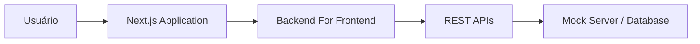
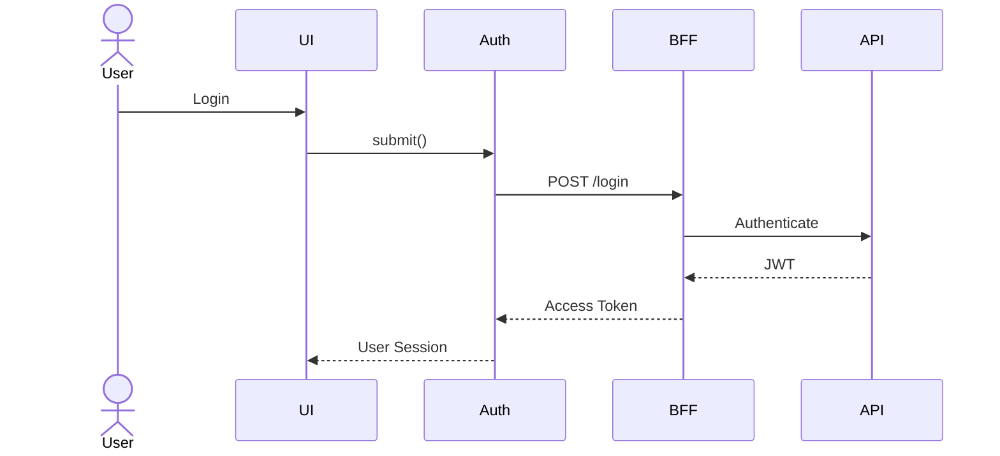

# System Overview

## Purpose
Este documento apresenta uma visão de alto nível da arquitetura do InsureHub.

Seu objetivo é descrever como os principais componentes do sistema interagem entre si, servindo como referência para decisões arquiteturais, desenvolvimento de novas funcionalidades e evolução da plataforma.

A arquitetura foi projetada para priorizar escalabilidade, modularidade, manutenibilidade e baixo acoplamento entre os domínios de negócio.

## High-Level Architecture

## Request Flow
O fluxo de comunicação seguirá as seguintes etapas:

1. O usuário realiza uma ação na interface.
2. O Next.js processa a requisição.
3. A camada de serviços comunica-se com o BFF.
4. O BFF centraliza regras de integração e autenticação.
5. O BFF consome as APIs REST.
6. A resposta retorna ao frontend para renderização.

## Authentication Flow

## Main Components
- **Next.js:** Interface da aplicação
- **React:** Componentização
- **Zustand:** Estado global
- **TanStack Query:** Cache e sincronização
- **BFF:** Agregação de APIs
- **Mock Server:** Simulação inicial do backend

## External Integrations
O sistema será preparado para integração com:

- API Gateway (Sensedia ou equivalente)
- Serviços AWS (S3, Lambda e CloudFront)
- Serviços de autenticação JWT
- APIs REST

## Non-Functional Requirements
A arquitetura deverá atender aos seguintes requisitos:

- Escalabilidade
- Performance
- Responsividade
- Acessibilidade (WCAG)
- Segurança
- Observabilidade
- Modularidade
- Testabilidade

## Future Evolution
Após a conclusão do MVP, a arquitetura evoluirá para:

- Micro Frontends
- CI/CD completo
- Observabilidade
- Docker
- Deploy em Cloud
- Testes E2E
- Monitoramento de Performance