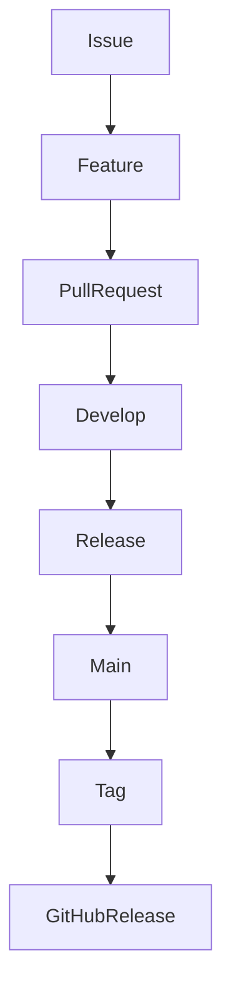
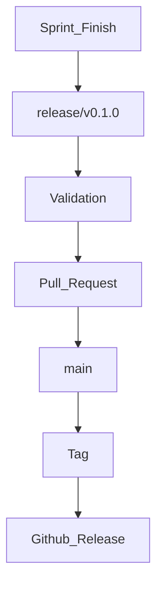

# Git Workflow

## Purpose
Este documento define o fluxo oficial de desenvolvimento utilizado no InsureHub.

O objetivo é garantir consistência na organização do código, facilitar revisões, manter um histórico de alterações claro e padronizar o processo de entrega de novas funcionalidades.

## Branch Strategy
```
main
│
├── develop
│
├── feature/*
│
├── release/*
│
└── hotfix/*
```
- **main -** Produção
- **develop -** Integração
- **feature -** Desenvolvimento de funcionalidades
- **release -** Estabilização antes de entrega
- **hotfix -** Correções urgentes em produção

## Branch Naming
### Features
```
feature/issue-001-production-vision
```

### Releases
```
release/v0.1.0
```

### Hotfix
```
hotfix/fix-login
```

## Development Flow

1. Criar Issue
2. Criar Branch
3. Desenvolver
4. Commit
5. Push
6. Pull Request
7. Review
8. Merge para ``develop``
9. Criar Release
10. Merge para ``main``
11. Criar Tag
12. Publicar Release


## Commit Convention
Formato:
```
type(scope): description
```

Tipos comuns:
- **feat -** Nova funcionalidade
- **fix -** Correção
- **docs -** Documentação
- **refactor -** Refatoração
- **test -** Testes
- **chore -** Manutenção
- **ci -** CI/CD
- **perf -** Performance
- **style -** Formatação

Exemplos:
```
feat(auth): implement login page

fix(api): handle token expiration

docs(architecture): define monorepo strategy
```

## Pull Requests
### Checklist

- Self Review
- Documentation Updated
- Build Passing
- No Merge Conflicts
- Issue Linked

## Code Review
- Arquiteuta
- Legilidade
- Performance
- Acessibilidade
- Testabilidade
- Segurança
- Nomeação
- Organização

## Releases


## Semantic Versioning
``MAJOR.MINOR.PATCH``

Exemplos:

0.1.0 - Fundação

0.2.0 - Estrutura Next

0.3.0 - Autenticação

1.0.0 - MVP

## Changelog
Exemplo:
### v0.1.0

#### Added

- Product Vision

- Business Domains

- Architecture Overview

- ADR-001

- Monorepo Strategy

## Best Practices
- Nunca desenvolver diretamente na branch ``main``
- Nunca fazer commit sem Issue
- Commits pequenos e objetivos
- Pull Requests focados em uma única mudança
- Revisar antes do merge
- Manter a documentação atualizada

## Related Documents
- Product Vision
- Business Domains
- System Overview
- ADR-001
- Monorepo Strategy